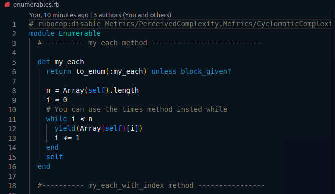

# 🧐 Advanced Building Blocks - Enumerables

> This is the second Ruby project from the Microverse program. It's a program built to understand how inbuilt methods work and how they are built.

## 🔧 Built With

- Ruby.
- Using Linters for Ruby.
- Using Bundler.

## 🛠 Getting Started

To get a local copy up and running follow these simple example steps.

- Go to the main page of te repo.
- Press the "Code" button and get the repo link.
- Clone it using git.
- Open terminal on that folder.
- Run the next command:
  ´\$ruby enumerables.rb´

## 👤 Authors

👤 **Paul Balitema**

- Github: [@pbkabali](https://github.com/pbkabali)
- Twitter: [@pbkabali](https://twitter.com/pbkabali)
- Linkedin: [[engineerbpk](www.linkedin.com/in/engineerbpk)

👤 **Giordano Díaz**

- Github: [@diazgio](https://github.com/diazgio)
- Twitter: [@giordano_diaz](https://twitter.com/giordano_diaz)
- LinkenIn:[LinkenIn](www.linkedin.com/in/Giordano-Diaz)

## 🤝 Contributing

Contributions, issues and feature requests are welcome!

Feel free to check the [issues page](issues/).

## Show your support

Give a ⭐️ if you like this project!

## 📝 License

This project is [MIT](lic.url) licensed.
